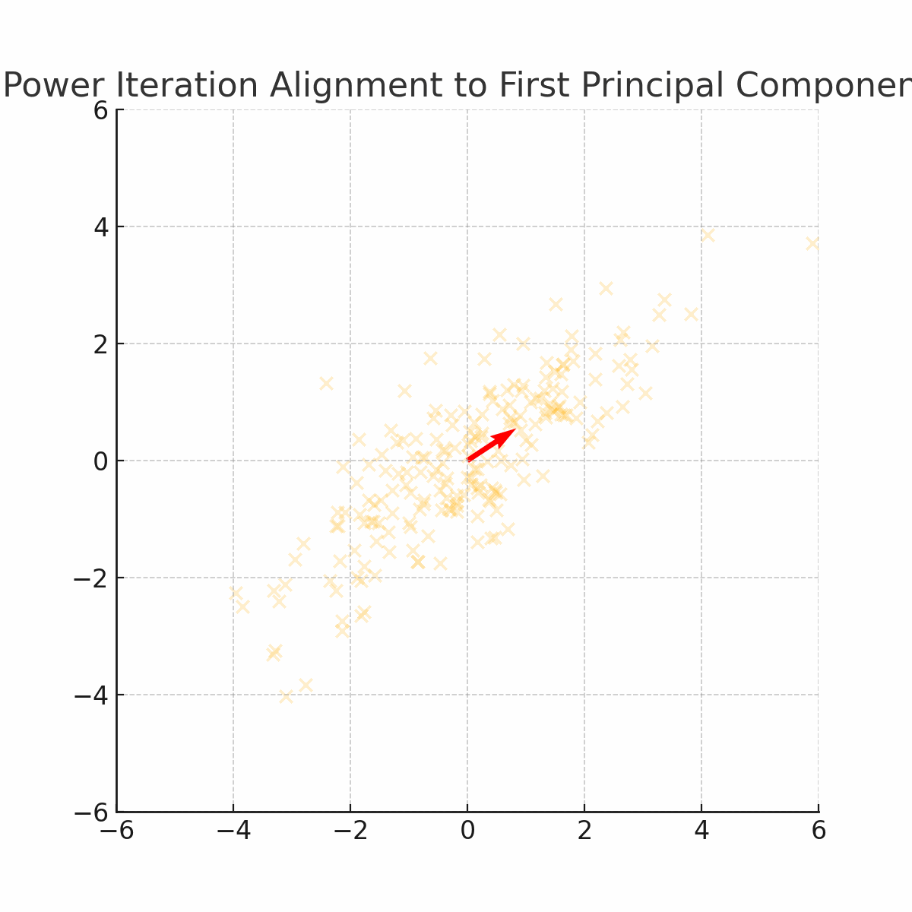

## Power Iteration Method

This algorithm follows these steps:

1. Start with a guess for the first principal component vector, `p_1` (a naive guess could be random or all zeros).

2. Calculate an estimate of the first score vector `t_1` using:  
`t_1 = X * p_1`

3. Normalize `p_1`. First, calculate the length (L) of `p_1`:  
`L = sum(p_{i,1}^2)`  
Then normalize:  
`p_j = p_j / sqrt(L)`

4. Update your guess for `t_1` by calculating:  
`t_1 = X * p_1`

5. Compare the new value of `t_1` with the old value by calculating:  
`delta = || t_old - t_new ||^2`  
If `delta` is below the tolerance threshold (for example, `0.001`), the process has converged. Otherwise, go back to step 2.

6. Shrink the data matrix by calculating:  
`X_shrunk = X - t_1 * p_1^T`  
This step "removes" the information about the principal component from the data matrix so that the next component can be calculated.

7. Go back to step 1 to calculate the next principal component.

